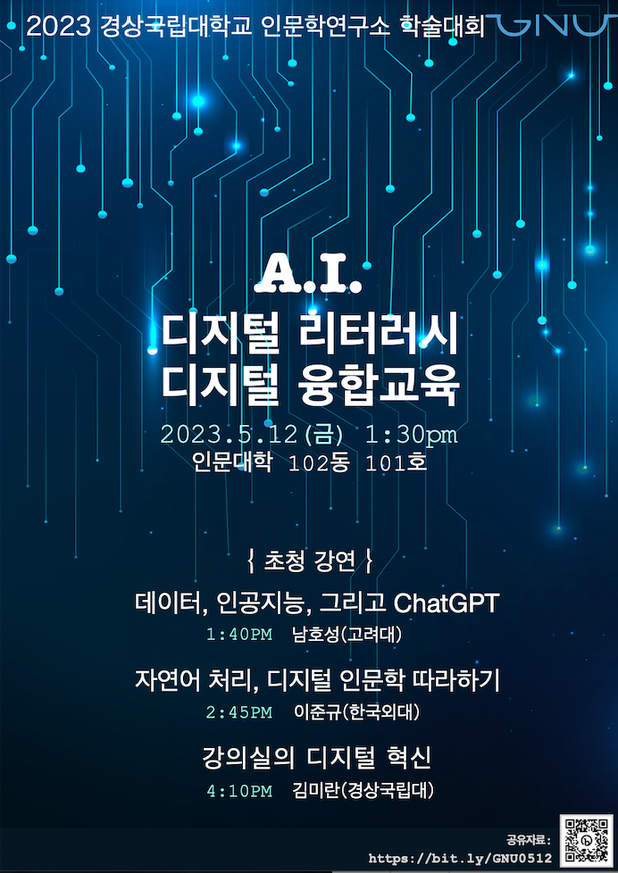

## 🌵 AI, Digital Literacy, and Convergence Education: Connecting Humanities and Technology  
### 2023년 경상국립대학교 인문학연구소 학술대회 초청강연 
_(주제: 인공지능, 디지털 리터러시, 그리고 융합교육: 인문학과 기술의 만남)_

  

[🔎 Poster view](https://github.com/MK316/workshops/blob/main/20230512_GNU/images/GNU0523_poster.png)
## 🌱 Information:
+ 일시: 2023년 5월 12일 1시 30분 시작 (3개 특강, 각 60분씩)
+ 장소: 인문대학 102동 101호
+ 주최: 경상국립대 인문학연구소(GNU Humanities Laboratory)

## _🌱Notes:_  
+ 발표자료는 5월 12일 현재 아래 테이블에 링크되어 있습니다.
+ 당일 실습을 직접 해 보고싶은 분들은 개인 디지털 기기를 가져오시면 됩니다. 노트북, 전자 패드, 스마트 폰 모두 가능합니다. 단, 스마트폰은 화면 크기 제한으로 일부 내용이 가려질 수 있습니다.)
+ 별도의 등록과정은 없으나 **참석하실 분은 👍[여기](https://forms.gle/2Txq7cp3Vugfs88H9)를 눌러 간단한 정보를 제공**해 주시면 준비하는 데 큰 도움이 됩니다.
+ 📲 아래 일정 테이블을 스마트폰에서 보시는 경우 테이블 여역에서 오른쪽으로 스크롤하면 가려지는 내용을 보실 수 있습니다. 
+ Session 2와 3은 코드로 작성된 자료입니다. **먼저 자료 링크를 따라간 후 자료페이지 시작 부분 상단에 있는 "Open in Colab"을 누르셔야 직접 코드를 실행해 볼 수 있습니다. (Colab 페이지로 이동후 구글 계정 로그인을 반드시 하셔야 합니다)**

|Schedule | Time | Duration | Invited Speakers | Topics | Lecture materials |
|--:|--|--|:--:|:--:|--|
|_Opening_| 1:30PM~ | 10 mins | |  ||
|**Session 01** |1:40PM~  | 60 mins.| Prof. [Hosung Nam](https://github.com/hsnam95)  ([Korea University](https://english.korea.ac.kr/english/about/professor.do)), [Namz 연구소](https://www.youtube.com/@namz8170/featured) |  **Data, AI, and ChatGPT**  (데이터, 인공지능, 그리고 챗지피티) | [Session 01 Slides](https://github.com/MK316/workshops/blob/main/20230512_GNU/GNU_Session01.pdf)|
|**Session 02** |2:45PM~  | 60 mins.| Prof. [Junkyu Lee](http://builder.hufs.ac.kr/user/indexSub.action?codyMenuSeq=81372758&siteId=gse2&menuType=T&uId=1&sortChar=A&linkUrl=1_4.html&mainFrame=right#gse2_09)  (Hankuk University of Foreign Studies) |**NLP, Topic-Modeling, Sentiment Analysis, Clustering**  (자연어처리와 디지털인문학 따라하기) |[Session2 자료링크](https://github.com/junkyuhufs/workshop/blob/main/GNU_Session2.ipynb)|
|_Break_| 3:50PM~  |20 mins.  |||
|**Session 03** |4:10PM~ | 60 mins.| Prof. [Miran Kim](https://github.com/MK316)  ([Dept. of English Education, GNU](https://www.gnu.ac.kr/englishedu/pi/prfsr/selectPrfsrIntrdView.do?mi=7463&ctgrySn=1403)) | **Digital Transformation in Class**  (강의실의 디지털 전환 ) |[Session3 자료링크](https://github.com/MK316/workshops/blob/main/20230512_GNU/GNU_session03.ipynb)|
| _Discussions_| 5:15PM~ | 30 mins|  |Q&As, Discussions with the audience ||

