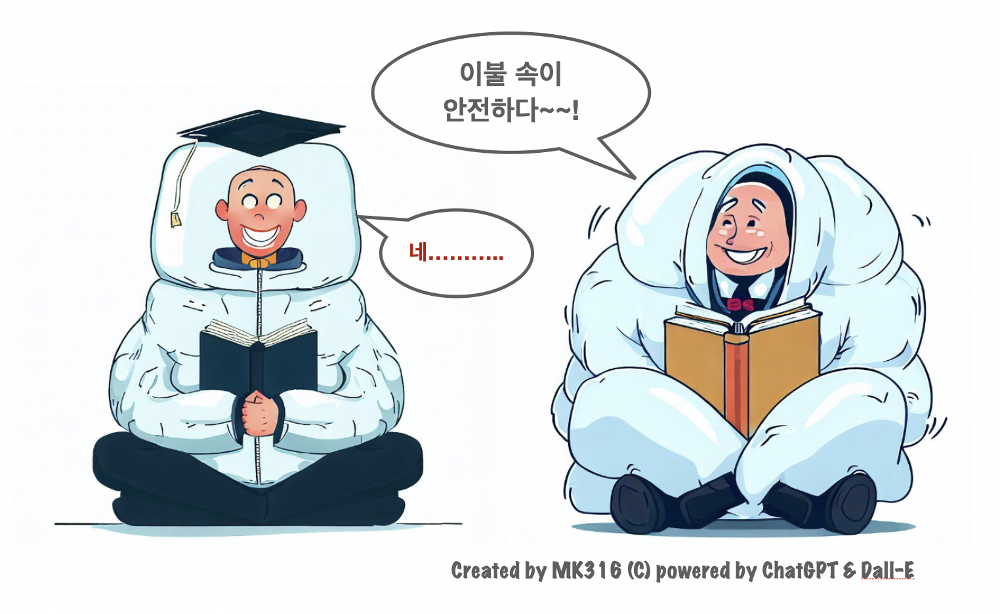

## 🌿 2023년 경상국립대학교 인문학연구소 발표회
### AI, Digital Literacy, and Convergence Education: Connecting Humanities and Technology
_주제: 인공지능, 디지털 리터러시, 그리고 융합교육: 인문학과 기술의 만남_

  
  

[🔎 Poster view](https://github.com/MK316/workshops/blob/main/20230512_GNU/images/GNU0523_poster.png)
## 🌱 Schedule:
+ Date: Friday, May 12, 2023
+ Location: Rm# 101, Humanities bldg.(인문대학 102동 101호)
+ Hosted by: GNU Humanities Laboratory (경상국립대 인문학연구소)

_Note: Presentation materials will be updated on May 11. (자료는 발표 전날 최종 업데이트될 예정입니다.)_

|Schedule | Time | Duration | Presenter | Topics | Lecture materials |
|--:|--|--|:--:|--|--|
|Opening| 1:30PM~ | 10 mins | Opening |  ||
|**Session 01** |1:40PM~  | 60 mins.| Prof. Hosung Nam  (Korea University) |  Data, AI, and ChatGPT  (데이터, 인공지능, 그리고 챗지피티) | |
|**Session 02** |2:45PM~  | 60 mins.| Prof. Jun-Kyu Lee  (Hankuk University of Foreign Studies) |NLP, Clustering, Sentiment Analysis, Topic-Modeling  (자연어처리와 디지털인문학 따라하기) ||
|_Break_| 3:50PM~  |20 mins.  |||
|**Session 03** |4:10PM~ | 60 mins.| Prof. Miran Kim  (GNU) | Digital transformation in class: the integration of personalized and adaptive learning process  (교실의 디지털식 전환) ||
| Discussions| 5:15PM~ | 30 mins| Discussions with the audience | ||

